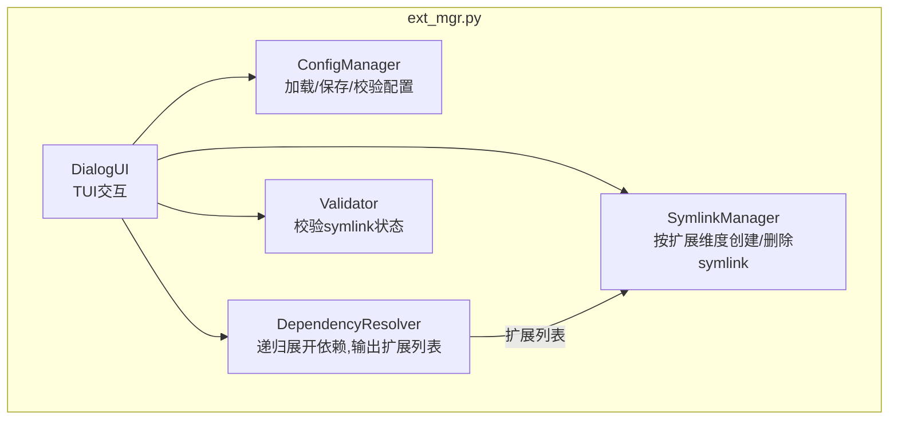
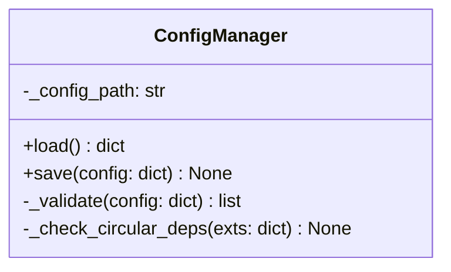
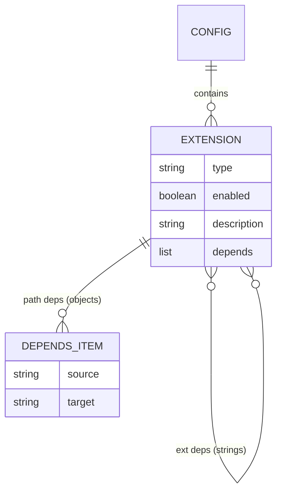
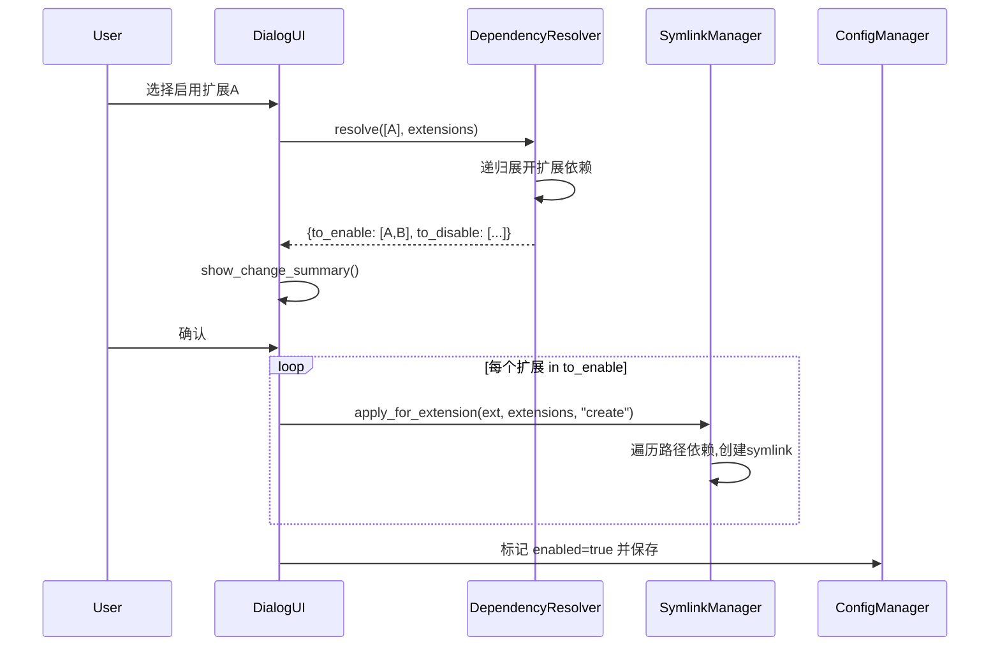
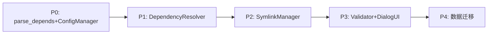

# 设计文档

| 字段 | 值 |
|------|------|
| Date | 2026-04-22 |
| Status | Approved |
| SRS Reference | docs/plans/2026-04-22-extension-schema-refactor-srs.md |
| Project | opencode-extension-manager 扩展配置结构重构 |

---

## 1. 架构概览

### 1.1 逻辑视图



### 1.2 技术栈

保持不变：Python 3.8+，无第三方依赖，dialog TUI。

---

## 2. 核心功能设计

### 2.1 depends 混合格式解析：parse_depends()

新增模块级辅助函数，统一解析 depends 列表：

```python
def parse_depends(depends_list):
    ext_deps = []
    path_deps = []
    for item in depends_list:
        if isinstance(item, str):
            ext_deps.append(item)
        elif isinstance(item, dict):
            path_deps.append(item)
    return ext_deps, path_deps
```

所有需要解析 depends 的地方统一调用此函数，避免重复的类型判断。

### 2.2 ConfigManager 变更

**_validate() 方法**：
- `VALID_CATEGORIES` → `VALID_TYPES = {"skill", "agent", "command", "plugin"}`
- key 校验：不允许包含 `/`、`..`、不以 `/` 开头
- 新增 type 字段校验（必须存在，值在 VALID_TYPES 内）
- depends 校验：遍历每个条目，字符串检查 key 格式，对象检查 source/target 字段存在
- version 校验：拒绝 version != 2
- 循环依赖检测：使用扩展依赖（字符串）构建图，DFS 检测

**类图**：



### 2.3 DependencyResolver 变更

**resolve() 方法重写**：

输入：用户选中的扩展列表 + 全部 extensions 配置

```python
def resolve(self, selected, extensions):
    to_enable = set(selected)
    to_disable = set()

    for name in list(to_enable):
        ext_deps, _ = parse_depends(extensions[name].get("depends", []))
        for dep in ext_deps:
            if dep in extensions and dep not in to_enable:
                to_enable.add(dep)

    to_disable = set(extensions.keys()) - to_enable

    rejected = []
    for name in list(to_disable):
        dependents = self._find_dependents(name, extensions, to_enable)
        if dependents:
            rejected.append({"name": name, "reason": "被依赖", "dependents": dependents})
            to_disable.discard(name)

    return {
        "to_enable": sorted(to_enable),
        "to_disable": sorted(to_disable),
        "rejected": rejected,
    }
```

**关键行为**：
- 使能时：递归展开扩展依赖，全部标记 enabled=true
- 去使能时：只禁用用户明确选择的扩展，不级联去使能依赖扩展

### 2.4 SymlinkManager 变更

**从"按路径名操作"改为"按扩展操作"**：

新增 `apply_for_extension()` 方法：

```python
def apply_for_extension(self, ext_name, extensions, action):
    _, path_deps = parse_depends(extensions[ext_name].get("depends", []))
    results = []
    for dep in path_deps:
        if action == "create":
            results.append(self._create_symlink(dep["source"], dep["target"]))
        else:
            results.append(self._remove_symlink(dep["target"]))
    return results
```

原有的 `create_symlink(ext_name)` 和 `remove_symlink(ext_name)` 替换为基于 source/target 路径的版本。

**_resolve_path() 移除**：不再通过 `category/name` 拼接路径，路径完全由 depends 中的 source/target 决定。

### 2.5 Validator 变更

**validate() 方法**：遍历每个扩展，通过 parse_depends 获取其路径依赖，逐个检查 symlink 状态。

### 2.6 DialogUI 变更

- `CATEGORY_LABELS` → `TYPES_LABELS`，key 为单数（"skill", "agent", "command", "plugin"）
- `CATEGORY_ORDER` → `TYPES_ORDER`
- `_build_checklist_items()`：按 `type` 字段过滤（`ext["type"] == category`），而非 key 前缀
- `_count_stats()`：同上
- `_check_availability()`：检查 depends 中路径依赖的源文件是否存在，扩展依赖的 key 是否在 extensions 中

---

## 3. 数据模型

### 3.1 extensions.json 新格式



### 3.2 新 extensions.json 示例

```json
{
  "version": 2,
  "extensions": {
    "ascend-c-integrated-development": {
      "type": "skill",
      "enabled": true,
      "description": "Ascend C自定义算子全流程开发（kernel/host/ONNX插件）",
      "depends": [
        "kernel-side-code-developer",
        "host-side-code-developer",
        "onnx-plugin-developer",
        {"source": "skills/ascend-c-integrated-development.md", "target": "skills/ascend-c-integrated-development.md"}
      ]
    },
    "kernel-side-code-developer": {
      "type": "agent",
      "enabled": true,
      "description": "Kernel侧代码开发",
      "depends": [
        {"source": "agents/kernel-side-code-developer.md", "target": "agents/kernel-side-code-developer.md"}
      ]
    },
    "brainstorming": {
      "type": "skill",
      "enabled": true,
      "description": "结构化头脑风暴，创意工作前必用",
      "depends": [
        {"source": "skills/brainstorming.md", "target": "skills/brainstorming.md"}
      ]
    }
  }
}
```

---

## 4. 关键交互序列

### 4.1 使能扩展序列图



---

## 5. 测试策略

- 框架：pytest（已有）
- 重点测试类：ConfigManager._validate()、DependencyResolver.resolve()、parse_depends()
- 覆盖目标：line >= 80%, branch >= 70%

---

## 6. 开发计划

| 优先级 | 特性 | 映射 FR | 说明 |
|--------|------|---------|------|
| P0 | parse_depends() + ConfigManager | FR-001~FR-004, FR-010 | 基础解析与校验 |
| P1 | DependencyResolver | FR-005, FR-006, FR-009 | 依赖解析核心逻辑 |
| P2 | SymlinkManager | FR-008 | 路径操作重构 |
| P3 | Validator + DialogUI | FR-011, FR-012 | UI 与校验适配 |
| P4 | extensions.json 迁移 | - | 手动更新 JSON 数据 |

依赖链：


