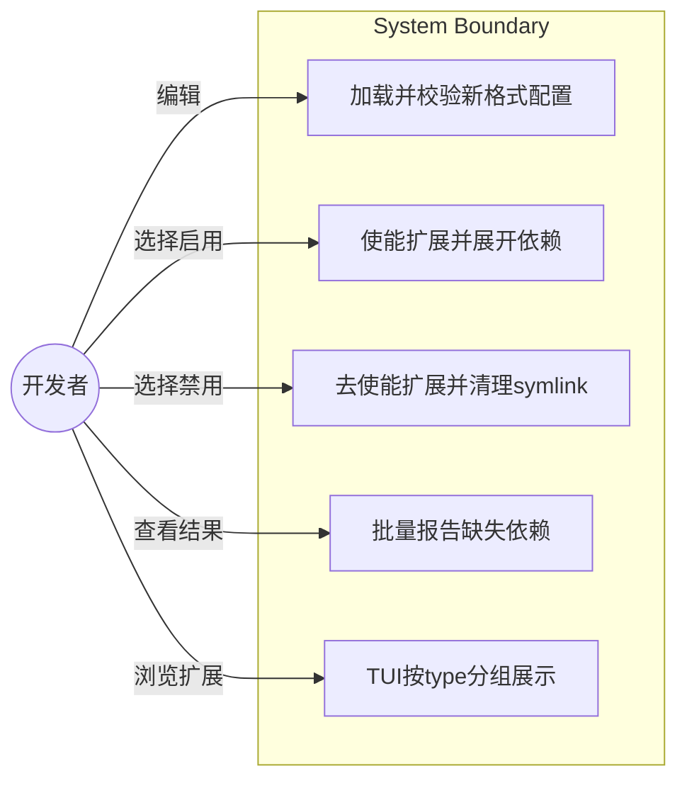
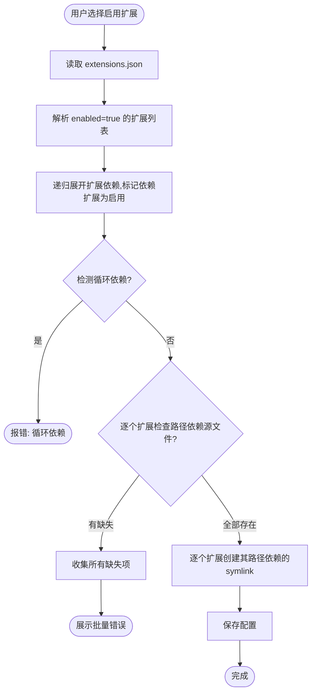
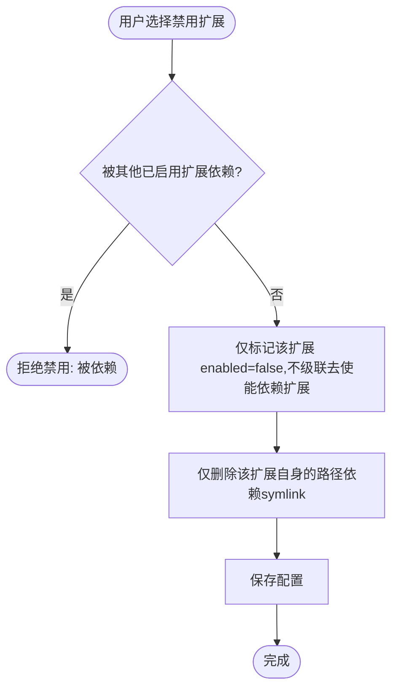

# 软件需求规格说明书 (SRS)

| 字段 | 值 |
|------|------|
| Date | 2026-04-22 |
| Status | Draft |
| Standard | ISO/IEC/IEEE 29148 |
| Project | opencode-extension-manager 扩展配置结构重构 |

---

## 1. 目的与范围

### 1.1 问题陈述

当前 `extensions.json` 的 key 采用 `category/name` 格式（如 `skills/brainstorming`），类别与名称耦合在 key 中。扩展的源文件路径通过 key 拼接推导（`source_dir/category/name`），不支持外部源路径。`depends` 字段仅支持扩展依赖（字符串引用其他 key），不支持路径依赖，且无法指定目标路径。

**目标**：重构 `extensions.json` 的数据结构和 `ext_mgr.py` 的处理逻辑，使 key 为纯扩展名，类型通过 `type` 字段独立声明，所有源-目标路径映射显式写在 `depends` 中。

### 1.2 范围

**包含**：
- `extensions.json` 数据结构重构（新 schema）
- `ext_mgr.py` 全部相关代码适配
- 旧的 `extensions.json` → 新格式的手动迁移（用户手动更新 JSON）

**排除**：
- 自动迁移脚本
- 向后兼容（不支持旧格式）
- 其他文件变更

### 1.3 用户画像

| 角色 | 描述 |
|------|------|
| 开发者 | 管理本地 opencode 扩展的开发者，通过 TUI 启用/禁用扩展 |

---

## 2. 术语表

| 术语 | 定义 |
|------|------|
| 扩展 (Extension) | 一个可独立启用/禁用的功能单元，包含主入口文件和可选依赖 |
| 扩展依赖 | depends 中引用其他扩展名的条目（字符串），启用时递归展开 |
| 路径依赖 | depends 中指定 source/target 路径映射的条目（对象），启用时创建 symlink |
| 主入口 | 扩展的核心文件（如 skill 的 .md 文件），也作为路径依赖记录在 depends 中 |
| source 路径 | 相对于本仓库根目录的文件/目录路径，或指向外部位置的相对路径（如 `../../other/file.md`） |
| target 路径 | symlink 在目标目录（如 `~/.config/opencode`）下的相对路径 |
| VALID_TYPES | 系统支持的扩展类型集合：{"skill", "agent", "command", "plugin"} |

---

## 3. 功能需求

### FR-001: 新数据结构

**The system shall** 使用以下 JSON schema 表示扩展配置：

```json
{
  "version": 2,
  "extensions": {
    "<extension-name>": {
      "type": "skill" | "agent" | "command" | "plugin",
      "enabled": true | false,
      "description": "<描述文本>",
      "depends": [
        "<other-extension-name>",
        {"source": "<相对源路径>", "target": "<相对目标路径>"}
      ]
    }
  }
}
```

**验收标准**：
- Given 一个合法的 extensions.json, When ConfigManager 加载它, Then 不报错并正确解析所有字段
- Given key 中包含 `/` 的扩展, When ConfigManager 校验, Then 报错提示 key 应为纯名称
- Given type 不在 VALID_TYPES 中, When ConfigManager 校验, Then 报错提示非法类型
- Given extensions 为空对象 `{}`, When ConfigManager 加载, Then 不报错（无扩展可管理）
- Given depends 为空数组 `[]`, When ConfigManager 加载, Then 不报错
- Given depends 中同一扩展被重复引用（如 `["B", "B"]`）, When 解析, Then 幂等处理（不重复创建 symlink）

**优先级**: Must  
**来源**: 用户需求

---

### FR-002: 扩展类型校验

**The system shall** 校验每个扩展的 `type` 字段值在 VALID_TYPES = {"skill", "agent", "command", "plugin"} 范围内。代码中所有引用旧常量名（VALID_CATEGORIES）和旧类型值（复数形式 "skills"/"agents"/"commands"）的地方均需更新。

**验收标准**：
- Given type="skill", Then 校验通过
- Given type="unknown", Then 报错 "扩展 '{name}' 的 type '{type}' 不合法"
- Given 缺少 type 字段, Then 报错 "扩展 '{name}' 缺少 type 字段"
- Given 代码中引用 VALID_CATEGORIES, When 全文搜索, Then 结果为 0
- Given VALID_TYPES 包含 "plugin", Then 校验 plugin 类型扩展通过

**优先级**: Must  
**来源**: 用户需求（合并原 FR-008）

---

### FR-003: key 格式校验

**The system shall** 校验扩展的 key 为纯名称，不含 `/`、`..`、不以 `/` 开头。depends 中的扩展依赖字符串也必须符合此格式。

**验收标准**：
- Given key="brainstorming", Then 校验通过
- Given key="skills/brainstorming", Then 报错提示 key 格式错误
- Given key="../evil", Then 报错包含非法字符
- Given depends=[""], When 校验, Then 报错提示扩展依赖名称不能为空
- Given depends=["a/b"], When 校验, Then 报错提示扩展依赖名称格式错误

**优先级**: Must  
**来源**: 用户需求（key 去掉 category 前缀）

---

### FR-004: depends 混合格式解析

**The system shall** 支持 depends 列表中两种格式的条目：
- **扩展依赖**：字符串，值为另一个扩展的 key
- **路径依赖**：对象，包含 `source` 和 `target` 两个相对路径

**验收标准**：
- Given depends=["other-ext", {"source": "a.md", "target": "b.md"}], When 解析, Then 识别出 1 个扩展依赖和 1 个路径依赖
- Given depends=["some-ext"], When some-ext 不存在于 extensions 中, Then 产生警告
- Given depends 中含有非法类型（如数字）, When 校验, Then 报错
- Given 路径依赖缺少 source 或 target 字段, When 校验, Then 报错提示缺少必要字段

**优先级**: Must  
**来源**: 用户需求

---

### FR-005: 依赖解析与展开（使能）

**When** 启用一个扩展时，**the system shall** 递归展开其 depends 中的扩展依赖，自动将所有被依赖的扩展也标记为 enabled=true（写入配置），然后对每个启用的扩展分别执行各自的路径依赖 symlink 创建。

**验收标准**：
- Given 启用扩展 A，A depends=[B, {source:"a.md", target:"a.md"}]，B depends=[{source:"b.md", target:"b.md"}], When 解析并保存, Then A.enabled=true, B.enabled=true，对 A 创建 a.md 的 symlink，对 B 创建 b.md 的 symlink
- Given 扩展 A depends=[B]，B depends=[A], When 解析, Then 报错检测到循环依赖
- Given 启用扩展 A，A depends=[B]，B.enabled=false（B 存在于 extensions 中但未启用）, When 解析并保存, Then to_enable 包含 B，B.enabled 自动置为 true
- Given 扩展 A depends=["nonexistent"], When 解析, Then 产生警告并跳过该扩展依赖
- Given 扩展已 enabled=true 再次启用, When 解析, Then symlink 状态为 skipped

**优先级**: Must  
**来源**: 用户需求

---

### FR-006: 依赖清理（去使能）

**When** 禁用一个扩展时，**the system shall** 仅将该扩展自身标记为 enabled=false 并删除其 depends 中列出的路径依赖 symlink。**不得**自动级联去使能其依赖的扩展——只有用户明确选择去使能的扩展才会被禁用。如果被禁用的扩展被其他已启用（enabled=true）的扩展依赖，则拒绝禁用。

**验收标准**：
- Given 禁用扩展 A，A depends=[B, {source:"a.md", target:"a.md"}]，B.enabled=true, When 执行并保存, Then A.enabled=false, B.enabled 保持 true（不级联去使能 B），仅删除 a.md 的 symlink
- Given 禁用扩展 A，扩展 B.enabled=true 且 B depends=[A], When DependencyResolver 解析, Then 提示拒绝禁用（被 B 依赖）
- Given 禁用扩展 A，扩展 B.enabled=false 且 B depends=[A], When DependencyResolver 解析, Then 允许禁用（B 未启用，不构成实际依赖）
- Given 禁用扩展 A，A depends 中某路径的 symlink 不存在, When 执行, Then 状态为 skipped
- Given 禁用扩展 A，A depends 中某路径的 symlink 已存在但指向错误目标, When 执行, Then 报告 conflict（不自动覆盖）

**优先级**: Must  
**来源**: 用户需求

---

### FR-007: 依赖缺失批量报告

**If** 启用过程中某个路径依赖的源文件不存在，**the system shall** 收集所有缺失项后一次性展示，而非遇到第一个错误就停止。

**验收标准**：
- Given 3 个源文件不存在, When 使能, Then 展示 3 个错误
- Given 所有源文件存在, When 使能, Then 无错误

**优先级**: Should  
**来源**: L2 需求细化

---

### FR-008: SymlinkManager 路径解析重构

**The system shall** 重构 SymlinkManager 的路径解析逻辑，不再通过 `category/name` 拼接源路径，而是从每个扩展的 depends 中的路径依赖项获取 source/target 路径。

**验收标准**：
- Given 扩展 "brainstorming" depends=[{"source": "skills/brainstorming.md", "target": "skills/brainstorming.md"}], When 使能, Then 在 target_dir/skills/brainstorming.md 创建指向 source_dir/skills/brainstorming.md 的 symlink
- Given 路径依赖 source 指向仓库外部（如 `../../other/file.md`）, When plugin 类型扩展, Then source 路径解析为相对于仓库根目录的外部路径，symlink 正常创建
- Given 使能时目标路径已存在且指向正确的源, When 执行, Then 状态为 skipped
- Given 使能时目标路径已存在但指向错误目标, When 执行, Then 报告 conflict

**优先级**: Must  
**来源**: 用户需求（主入口也在 depends 中，路径不再自动推导）

---

### FR-009: DependencyResolver 重构

**The system shall** 重构 DependencyResolver，支持新的数据结构：
- 扩展依赖通过字符串匹配扩展 key
- 启用时递归将依赖扩展也标记为 enabled=true 并写入配置
- 禁用时仅标记用户明确选择的扩展为 enabled=false，不级联去使能依赖扩展
- 如果目标扩展被其他已启用扩展依赖，则拒绝去使能
- SymlinkManager 逐个扩展处理其 depends 中的路径依赖

**验收标准**：
- Given resolve 被调用, When depends 包含混合格式, Then 正确区分扩展依赖与路径依赖
- Given 扩展 A depends=[B]，B depends=[C], When 启用 A, Then to_enable 包含 A、B、C

**优先级**: Must  
**来源**: FR-005, FR-006 的编排需求

---

### FR-010: version 字段更新

**The system shall** 将 `extensions.json` 的 `version` 从 `1` 更新为 `2`，并拒绝加载 version != 2 的配置。

**验收标准**：
- Given version=2, When 加载, Then 成功
- Given version=1, When 加载, Then 报错 "不支持的 version: 1"
- Given 缺少 version, When 加载, Then 报错 "缺少 version 字段"

**优先级**: Must  
**来源**: 数据结构变更需要版本号区分

---

### FR-011: DialogUI 分类展示适配

**The system shall** 按 `type` 字段（而非 key 前缀）对扩展进行分组展示。

**验收标准**：
- Given 扩展列表包含 type=skill 和 type=agent, When TUI 展示, Then 按 "Skills"、"Agents" 等分组
- Given type=plugin 的扩展, When TUI 展示, Then 出现在 "Plugins" 分组中

**优先级**: Must  
**来源**: FR-003 key 不再包含类型前缀

---

### FR-012: Validator 校验逻辑适配

**The system shall** 重构 Validator，不再通过 `category/name` 拼接目标路径，而是遍历每个扩展的 depends 中的路径依赖项进行校验。

**验收标准**：
- Given 扩展 enabled=true 且 depends 中路径 symlink 存在且正确, When validate, Then status=ok
- Given 扩展 enabled=true 但 depends 中路径 symlink 缺失, When validate, Then 报告 missing
- Given 扩展 enabled=false 但 depends 中路径 symlink 仍存在, When validate, Then 报告 unexpected

**优先级**: Must  
**来源**: FR-008 路径解析变更

---

## 4. 非功能需求

### NFR-001: 错误信息可读性

所有校验错误信息应包含扩展名称和具体违规字段，使用中文。错误信息格式为 `"扩展 '{name}' {具体问题描述}"`。

**度量标准**: 每个 ConfigError 消息中包含扩展 key 和违规字段名（如 "扩展 'foo' 缺少 type 字段"）。

### NFR-002: 数据完整性

`config_mgr.save()` 的原子写入机制（先写临时文件再 replace）保持不变。

---

## 5. 约束与假设

### 约束

| ID | 约束 |
|----|------|
| CON-001 | Python 3.8+，无外部依赖 |
| CON-002 | 仅 Linux 环境，依赖 dialog TUI |
| CON-003 | 不支持向后兼容，version 直接从 1 升到 2 |

### 假设

| ID | 假设 |
|----|------|
| ASM-001 | 用户会手动更新 extensions.json 到新格式（旧 depends 中的纯路径字符串如 `references/cpp-coding-standards` 需转为 `{"source": "...", "target": "..."}` 对象） |
| ASM-002 | source 路径可以是仓库内的相对路径或指向外部的相对路径（如 `../../other-repo/file.md`） |
| ASM-003 | target 路径始终是相对于目标目录的路径 |

---

## 6. 用例视图

### 6.1 用例图



### 6.2 使能流程数据流图



### 6.3 去使能流程数据流图



---

## 7. 排除项

- 自动迁移脚本（用户手动更新 JSON）
- 向后兼容旧格式
- 多语言支持
- 网络远程扩展源
