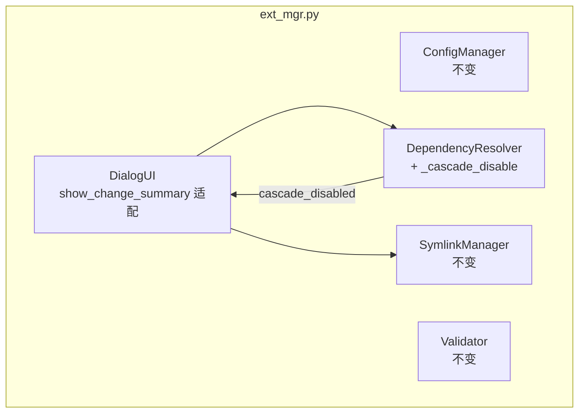
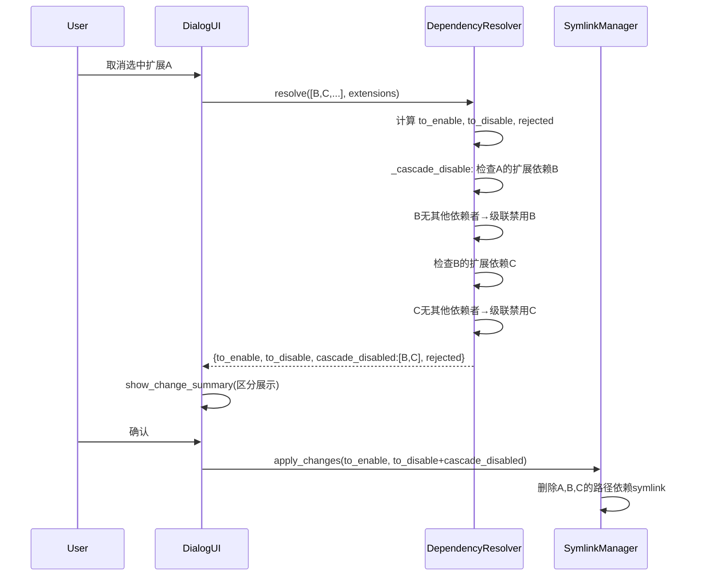

# 设计文档：依赖清理级联去使能

| 字段 | 值 |
|------|------|
| Date | 2026-04-23 |
| Status | Approved |
| SRS Reference | docs/plans/2026-04-23-cascade-disable-srs.md (inline) |
| Base Design | docs/plans/2026-04-22-extension-schema-refactor-design.md |
| Project | opencode-extension-manager 依赖清理级联去使能 |

---

## 1. 架构概览

### 1.1 逻辑视图



保持单文件 `ext_mgr.py` 架构。仅修改 DependencyResolver 和 DialogUI.show_change_summary()。

### 1.2 技术栈

不变：Python 3.8+, 无第三方依赖, dialog TUI, pytest。

---

## 2. 核心功能设计

### 2.1 DependencyResolver 变更

#### 2.1.1 新增 `_cascade_disable()` 方法

```python
def _cascade_disable(self, to_enable, to_disable, extensions):
    cascade_disabled = set()
    changed = True
    while changed:
        changed = False
        all_disabled = to_disable | cascade_disabled
        for name in all_disabled:
            ext_deps, _ = parse_depends(
                extensions.get(name, {}).get("depends", [])
            )
            for dep in ext_deps:
                if dep not in to_enable:
                    continue
                if dep in to_disable or dep in cascade_disabled:
                    continue
                remaining_dependents = self._find_dependents_excluding(
                    dep, extensions, to_enable, all_disabled
                )
                if not remaining_dependents:
                    to_enable.discard(dep)
                    cascade_disabled.add(dep)
                    changed = True
    return cascade_disabled
```

**关键行为**：
- 迭代扫描所有 to_disable 和已级联禁用扩展的扩展依赖
- 对每个在 to_enable 中的扩展依赖，检查排除所有禁用扩展后是否仍有其他依赖者
- 若无其他依赖者，从 to_enable 移入 cascade_disabled
- 迭代直到无新的级联禁用项

#### 2.1.2 新增 `_find_dependents_excluding()` 方法

```python
def _find_dependents_excluding(self, name, extensions, candidates, excluded):
    dependents = []
    for ext_name, ext_data in extensions.items():
        if ext_name in excluded:
            continue
        if ext_name not in candidates:
            continue
        ext_deps, _ = parse_depends(ext_data.get("depends", []))
        if name in ext_deps:
            dependents.append(ext_name)
    return sorted(dependents)
```

与现有 `_find_dependents()` 类似，但接受 `excluded` 集合排除特定扩展。

#### 2.1.3 resolve() 方法变更

在现有逻辑（rejection check 之后）追加级联处理：

```python
def resolve(self, selected, extensions):
    to_enable = set(selected)
    for name in selected:
        self._collect_deps(name, extensions, to_enable)

    to_disable = set(extensions.keys()) - to_enable

    rejected = []
    for name in list(to_disable):
        dependents = self._find_dependents(name, extensions, to_enable)
        if dependents:
            rejected.append({...})
            to_disable.discard(name)

    cascade_disabled = self._cascade_disable(
        to_enable, to_disable, extensions
    )

    return {
        "to_enable": sorted(to_enable),
        "to_disable": sorted(to_disable),
        "cascade_disabled": sorted(cascade_disabled),
        "rejected": rejected,
    }
```

### 2.2 DialogUI.show_change_summary() 变更

新增 `cascade_disabled` 展示分组：

```python
def show_change_summary(self, changes):
    lines = ["\\Zb\\Z4变更摘要:\\Zn\n"]
    if changes.get("to_enable"):
        lines.append("\\Zb\\Z5启用:\\Zn")
        for n in changes["to_enable"]:
            lines.append(f"  + {n}")
    if changes.get("to_disable"):
        lines.append("")
        lines.append("\\Zb\\Z1禁用:\\Zn")
        for n in changes["to_disable"]:
            lines.append(f"  - {n}")
    if changes.get("cascade_disabled"):
        lines.append("")
        lines.append("\\Zb\\Z3级联禁用:\\Zn")
        for n in changes["cascade_disabled"]:
            lines.append(f"  ~ {n}")
    if changes.get("rejected"):
        for r in changes["rejected"]:
            lines.append(
                f"拒绝禁用 {r['name']}: {r['reason']} "
                f"({', '.join(r.get('dependents', []))})"
            )
    return self._adapter.run_yesno("确认", "\n".join(lines)) == 0
```

### 2.3 main() 变更

在 main() 中将 cascade_disabled 合并到 to_disable 进行 symlink 操作和配置保存：

```python
# 现有 rejected 处理不变

# 变更摘要已包含 cascade_disabled
if not ui.show_change_summary(changes):
    continue

# 合并级联禁用到 to_disable
all_disable = changes["to_disable"] + changes["cascade_disabled"]

results = symlink_mgr.apply_changes(
    changes["to_enable"], all_disable, extensions
)
ui.show_results(results)

for name in changes["to_enable"]:
    if name in extensions:
        extensions[name]["enabled"] = True
for name in all_disable:
    if name in extensions:
        extensions[name]["enabled"] = False

config_mgr.save(config)
```

---

## 3. 交互序列

### 3.1 级联禁用序列图



---

## 4. 测试策略

- 框架：pytest（已有）
- 重点测试：DependencyResolver._cascade_disable()、resolve() 新返回值、show_change_summary() 展示
- 覆盖目标：新增代码 line >= 80%, branch >= 70%

---

## 5. 开发计划

| 优先级 | 特性 | 映射 FR | 说明 |
|--------|------|---------|------|
| P0 | DependencyResolver._cascade_disable() + resolve() 变更 | FR-001 | 核心级联逻辑 |
| P1 | main() 适配 + DialogUI.show_change_summary() 适配 | FR-002, FR-003, FR-004 | 调用和展示层 |

依赖链：


