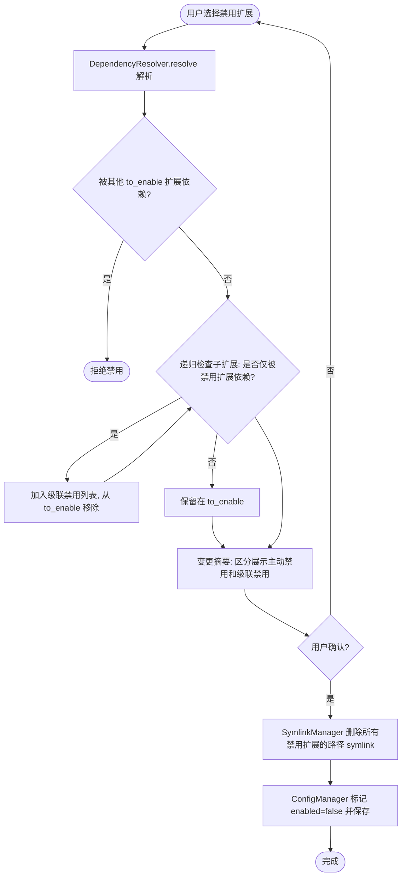

# 软件需求规格说明书 (SRS) — 依赖清理级联去使能

| 字段 | 值 |
|------|------|
| Date | 2026-04-23 |
| Status | Approved |
| Standard | ISO/IEC/IEEE 29148 |
| Project | opencode-extension-manager 依赖清理级联去使能 |
| Base SRS | docs/plans/2026-04-22-extension-schema-refactor-srs.md |
| Base Design | docs/plans/2026-04-22-extension-schema-refactor-design.md |

---

## 1. 目的与范围

### 1.1 问题陈述

当前 DependencyResolver 在禁用扩展时不级联去使能其依赖的子扩展。这导致"孤儿扩展"残留——子扩展仍标记为 `enabled=true`，但已无任何已启用扩展依赖它。需要新增级联去使能逻辑：禁用扩展时，递归检查其子扩展，若子扩展不再被任何其他已启用扩展依赖，则自动级联禁用。

### 1.2 范围

**包含**：
- DependencyResolver.resolve() 新增级联去使能逻辑
- DialogUI.show_change_summary() 区分展示级联禁用项
- SymlinkManager 正常处理级联禁用扩展的 symlink 删除
- ConfigManager 正确标记级联禁用扩展为 `enabled=false`

**排除**：
- 启用时行为变更（仍递归展开依赖）
- UI 新控件或交互流程变更
- extensions.json schema 变更
- extensions.json 版本号变更

### 1.3 用户画像

| 角色 | 描述 |
|------|------|
| 开发者 | 管理本地 opencode 扩展的开发者，通过 TUI 启用/禁用扩展 |

---

## 2. 术语表

| 术语 | 定义 |
|------|------|
| 级联去使能 | 禁用扩展时，自动禁用仅被该扩展依赖的子扩展（递归） |
| 孤儿扩展 | 已启用但无其他已启用扩展依赖的扩展 |
| 主动禁用 | 用户通过 TUI 明确取消选中的扩展 |
| 级联禁用 | 由级联逻辑自动标记为禁用的扩展（非用户主动选择） |
| to_enable | 解析结果中标记为启用（`enabled=true`）的扩展集合 |
| to_disable | 解析结果中标记为禁用（`enabled=false`）的扩展集合 |

---

## 3. 功能需求

### FR-001: 递归级联去使能

**When** DependencyResolver 解析用户选择后产生 `to_disable` 集合，**the system shall** 对 `to_disable` 中每个扩展的扩展依赖进行递归检查：若某个扩展依赖项在 `to_enable` 中，且不被 `to_enable` 中任何其他扩展（排除 `to_disable` 和已级联禁用的扩展）所依赖，则将其从 `to_enable` 移入级联禁用列表，并递归检查该扩展自身的扩展依赖。

**验收标准**：

- Given A depends=[B], B depends=[C], 用户仅禁用 A, 无其他扩展依赖 B 和 C, When 解析, Then B 和 C 均被级联禁用
- Given A depends=[B], D depends=[B], A 被禁用但 D 仍在 to_enable 中, When 解析, Then B 不被级联禁用（D 仍依赖 B）
- Given A depends=[B], B 在用户 selected 列表中（用户主动保留 B）, When 解析, Then B 不被级联禁用
- Given A depends=[B], B depends=[C], D depends=[C], A 被禁用 D 保留, When 解析, Then B 被级联禁用, C 不被级联禁用（D 依赖 C）
- Given A depends=[B], C depends=[B], 用户同时禁用 A 和 C, 无其他扩展依赖 B, When 解析, Then B 被级联禁用

**优先级**: Must
**来源**: 用户需求

---

### FR-002: 变更摘要区分展示级联禁用项

**When** resolve() 返回的级联禁用列表非空，**the system shall** 在变更摘要对话框中将主动禁用和级联禁用的扩展分别列出，使开发者清楚区分。

**验收标准**：

- Given 级联禁用列表包含 B 和 C, When 展示变更摘要, Then 包含"级联禁用"分组并列出 B 和 C
- Given 无级联禁用项, When 展示变更摘要, Then 不显示"级联禁用"分组
- Given A 主动禁用, B 级联禁用, When 展示变更摘要, Then A 出现在"禁用"分组, B 出现在"级联禁用"分组

**优先级**: Must
**来源**: 用户需求

---

### FR-003: SymlinkManager 处理级联禁用扩展

**The system shall** 将级联禁用的扩展与主动禁用的扩展统一处理，对其 `depends` 中的路径依赖执行 symlink 删除操作。

**验收标准**：

- Given A 主动禁用, B 级联禁用, B depends=[{source:"b.md", target:"b.md"}], When 执行, Then 删除 B 的 symlink
- Given 级联禁用的扩展无路径依赖, When 执行, Then 状态为 skipped

**优先级**: Must
**来源**: FR-001 的编排需求

---

### FR-004: 配置回写级联禁用状态

**When** 操作完成, **the system shall** 将级联禁用的扩展在 `extensions.json` 中标记为 `enabled=false` 并保存，与主动禁用扩展一致。

**验收标准**：

- Given B 被级联禁用, When 配置保存并重新加载, Then extensions["B"]["enabled"] == false
- Given A 主动禁用, B 级联禁用, When 配置保存并重新加载, Then A.enabled=false, B.enabled=false

**优先级**: Must
**来源**: FR-001 的持久化需求

---

## 4. 非功能需求

### NFR-001: 错误信息可读性

级联禁用的展示信息使用中文，明确标注"级联禁用"以区分主动禁用。格式遵循现有错误信息约定（`扩展 '{name}' ...`）。

### NFR-002: 数据完整性

`config_mgr.save()` 的原子写入机制保持不变。

---

## 5. 约束与假设

### 约束

| ID | 约束 |
|----|------|
| CON-001 | 级联去使能仅影响不在用户 `selected` 列表中的扩展（用户主动选中的扩展不会被级联禁用） |
| CON-002 | 现有拒绝逻辑保持不变：被 `to_enable` 中扩展依赖的扩展仍被拒绝禁用 |
| CON-003 | Python 3.8+, 无外部依赖 |
| CON-004 | 不改变 `extensions.json` schema 和 version |

### 假设

| ID | 假设 |
|----|------|
| ASM-001 | "只被这一个扩展依赖"的判定范围为 `to_enable` 集合中的扩展（排除 `to_disable` 和级联禁用扩展后的剩余启用扩展） |
| ASM-002 | 循环依赖在加载时已被 ConfigManager._check_circular_deps() 检测，级联逻辑无需处理循环情况 |

---

## 6. 用例视图

### 6.1 去使能流程数据流图

---

## 7. 排除项

- 启用时递归展开行为变更
- TUI 交互流程或控件变更
- extensions.json schema 或 version 变更
- 自动迁移脚本
- 多语言支持
