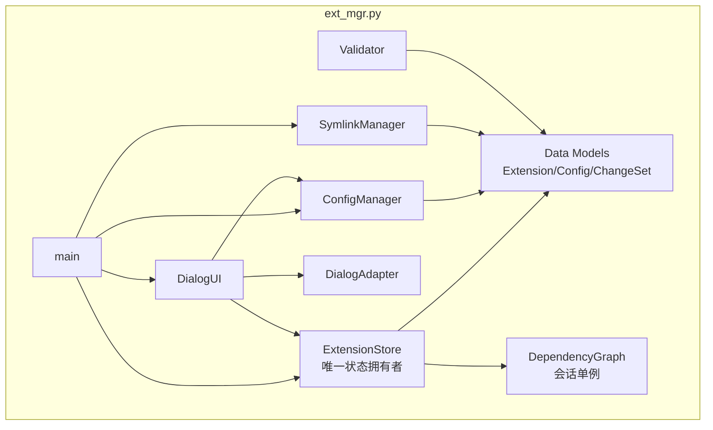

# 设计文档：ext_mgr.py 架构重构

| 字段 | 值 |
|------|------|
| Date | 2026-06-22 |
| Status | Approved |
| Project | opencode-extension-manager 内部架构重构 |
| Scope | 单文件 `ext_mgr.py` 内部重设计（含数据模型），不拆分文件，不改变外部 JSON 格式 |

---

## 0. 目标与约束

### 0.1 目标

- 架构合理：单文件内分层清晰，依赖单向向下
- 易维护：消除重复逻辑、集中散落常量、明确状态归属
- 易扩展：引入数据模型，新功能有清晰的落点

### 0.2 约束

- **单文件**：保持 `ext_mgr.py` 一个文件（小工具，不引入包结构）
- **全面重设计**：引入 `@dataclass` 数据模型
- **公开 API 可重构**：允许调整类名/方法签名/返回类型，测试相应迁移
- **行为等价**：级联、解析、保存的对外语义不变；`extensions.json` (version 3) 字节级兼容
- **技术栈不变**：Python 3.8+，仅标准库，dialog TUI，pytest

### 0.3 不在范围内（YAGNI）

- 不拆分多文件 / 不引入 `src/` 包结构
- 不引入不可变状态 + 纯函数架构（对交互式 TUI 过度设计）
- 不把 `Validator` 纳入 `main()` 运行时主循环（当前运行时也未调用）

---

## 1. 现状问题

当前 `ext_mgr.py`（881 行）存在以下架构问题：

| 问题 | 表现 |
|------|------|
| 单文件平铺 9+ 关注点 | 类之间通过共享可变 `extensions` 字典耦合 |
| 状态归属不清 | `extensions` 字典在 `ConfigManager` / `DependencyResolver` / `DialogUI` / `main()` 中被原地修改 |
| 级联逻辑重复 | `DialogUI._cascade_disable_deps`（前向传播，改状态）与 `DependencyResolver._cascade_disable`（反向分类，仅显示）两份实现 |
| `DependencyGraph` 多次重建 | `DependencyResolver.resolve` / `DialogUI._cascade_disable_deps` / `ConfigManager._check_circular_deps` 各自重建或重写 DFS |
| UI 越层 | `DialogUI` 直接 `import` 并使用 `DependencyGraph` 与 `parse_depends`，混合表现与领域 |
| 无数据模型 | 扩展是裸 dict，靠字符串键访问，易拼错、无类型提示 |
| 散落魔法值 | 状态字符串（`"success"`/`"conflict"`/...）与 dialog 颜色码（`\\Zb\\Z1` 等）遍布各处 |
| `main()` 冗长 | 末尾手写状态同步块（`resolve` 已能推断，冗余） |

---

## 2. 架构概览

### 2.1 单文件分区（自顶向下，依赖单向向下）

```
┌─────────────────────────────────────────────────────────┐
│ 1. Constants & Helpers                                  │
│    GROUP_TO_TYPE / TYPE_TO_GROUP / parse_depends        │
│    Status / Format / DEFAULT_TARGET_DIR                 │
├─────────────────────────────────────────────────────────┤
│ 2. Data Models                                          │
│    PathDep / Extension / Config / ChangeSet             │
├─────────────────────────────────────────────────────────┤
│ 3. Exceptions                                           │
│    ConfigError                                          │
├─────────────────────────────────────────────────────────┤
│ 4. Domain Layer（唯一状态拥有者）                        │
│    DependencyGraph  ← 会话内单例                         │
│    ExtensionStore   ← 封装 extensions + graph            │
├─────────────────────────────────────────────────────────┤
│ 5. I/O Layer                                            │
│    ConfigManager / SymlinkManager / Validator           │
├─────────────────────────────────────────────────────────┤
│ 6. UI Layer                                             │
│    DialogAdapter / DialogUI                             │
├─────────────────────────────────────────────────────────┤
│ 7. Entry Point                                          │
│    main()                                               │
└─────────────────────────────────────────────────────────┘
```

### 2.2 依赖规则（强制）

- UI 层 → 领域层 + I/O 层（不反向）
- I/O 层 → 领域层（`ConfigManager` 需 Data Models；`SymlinkManager`/`Validator` 需 `dict[str, Extension]` 视图）
- 领域层 → Data Models + Constants（自包含，不碰 UI/IO）
- Data Models / Constants → 仅标准库

### 2.3 逻辑视图



---

## 3. 数据模型

新增 4 个 `@dataclass`（纯数据，无业务行为）：

```python
from dataclasses import dataclass, field
from typing import List, Dict

@dataclass
class PathDep:
    """路径依赖（source→target 符号链接映射）。"""
    source: str
    target: str

@dataclass
class Extension:
    """单个扩展的领域模型。depends 在加载时即拆分为两类。"""
    name: str
    type: str                                    # "skill"|"agent"|"command"|"plugin"
    enabled: bool
    description: str
    ext_deps: List[str] = field(default_factory=list)
    path_deps: List[PathDep] = field(default_factory=list)
    visible: bool = True

@dataclass
class Config:
    """整体配置。extensions 为扁平 dict[name -> Extension]。"""
    version: int
    extensions: Dict[str, Extension]
    warnings: List[str] = field(default_factory=list)
    extra: Dict = field(default_factory=dict)    # 兜底未知顶层字段

@dataclass(frozen=True)
class ChangeSet:
    """resolve_changes 的不可变返回值。"""
    to_enable: List[str]
    to_disable: List[str]                        # 用户明确禁用
    cascade_disabled: List[str]                  # 孤儿级联禁用
    rejected: List[Dict]                         # [{"name","reason","dependents"}]
```

### 3.1 设计要点

1. **`depends` 加载即拆分**：`parse_depends` 仅在 `ConfigManager.load()` 内部使用一次，把原始 `depends` 拆为 `ext_deps` / `path_deps` 存入 `Extension`。后续消费方直接用字段，不再每次 `parse_depends`。`parse_depends` 保留为模块级函数（测试在用）。

2. **`Extension` 可变、`ChangeSet` 冻结**：`enabled` 是会话内可变状态；`ChangeSet` 是计算快照，冻结防误改。

3. **`Config.extra` 兜底未知顶层字段**：当前 `save()` 原样回写非 `extensions`/`warnings` 的顶层键。新版用 `extra` 显式承载，避免静默丢失。

4. **行为零变化**：数据模型只描述结构；现有验证规则、JSON schema (version 3)、字段含义均不变。

5. **`type` 字段**：仍由所属分类组推导（`GROUP_TO_TYPE`），存于 `Extension.type` 便于 UI 分组。`save()` 回写时剥除 `type`、省略默认 `visible:true`，磁盘格式逐字节兼容。

---

## 4. 领域层

### 4.1 `DependencyGraph`（保留，改为会话单例）

- 结构不变（forward / reverse 邻接表）
- 构造时从 `dict[str, Extension]` 读 `ext.ext_deps`，不再调 `parse_depends`
- 由 `ExtensionStore` 在构造时**建一次**，会话内不再重建
- 保留 `deps_of` / `dependents_of` / `has_enabled_dependent`，签名改为接收 `dict[str, Extension]`

### 4.2 `ExtensionStore`（新增，唯一状态拥有者）

`DependencyResolver` 的全部职责 + `DialogUI` 中越层的领域逻辑收归于此：

```python
# 类型注解统一用 typing 模块形式（Python 3.8+ 兼容，与现有代码约定一致）
from typing import Dict, List, Optional, Set

class ExtensionStore:
    def __init__(self, extensions: Dict[str, Extension], source_dir: str):
        self._extensions = extensions          # 唯一可变状态持有处
        self._source_dir = source_dir
        self._graph = DependencyGraph(extensions)   # 单例

    # 只读视图
    @property
    def extensions(self) -> Dict[str, Extension]
    def get(self, name) -> Optional[Extension]
    def by_type(self, ext_type) -> List[Extension]
    def names(self) -> List[str]

    # 可用性检查（从 DialogUI 移入）
    def check_availability(self, name) -> List[str]

    # 显式 toggle（不改级联）
    def set_enabled(self, name, enabled) -> None

    # 统一前向级联原语（核心去重）
    def cascade_disable(self, seed: Set[str]) -> Set[str]:
        """seed 刚被关掉 → 前向 BFS：若某 forward dep 已无任何 enabled
        dependent，则禁用它并入队继续。返回 seed+新级联 的完整集合。
        改写 enabled 标志。"""

    # apply 期解析（取代 DependencyResolver.resolve）
    def resolve_changes(self, selected: List[str]) -> ChangeSet

    # 私有：apply 期显示分类
    def _classify_for_display(self, actual_disable: Set[str]) -> Set[str]:
        """在 actual_disable 中，把所有 dependent 也都属于 actual_disable
        的 name 标为 cascade_disabled。纯查询，不改状态。"""
```

### 4.3 级联逻辑去重（关键决策）

经分析，当前两份"级联"是**两种不同操作**，本设计区分对待：

| 操作 | 当前位置 | 性质 | 新归属 |
|------|----------|------|--------|
| **前向传播**：禁用 X 后，把无人再依赖的 forward dep 也禁掉（改状态） | `DialogUI._cascade_disable_deps` | 状态突变 | `ExtensionStore.cascade_disable`（唯一实现） |
| **反向分类**：在待禁用集合中，把"所有 dependent 也都被禁"的标为级联（仅显示） | `DependencyResolver._cascade_disable` | 纯查询 | `ExtensionStore._classify_for_display`（私有） |

**去重的只是前向传播那份**（当前唯一改状态的级联，原本藏在 UI 里）。反向分类保留为 store 私有方法，因为它解决的是显示问题、与前向传播本质不同。两者共用同一个 `DependencyGraph` 单例。

### 4.4 `resolve_changes` 的状态同步

`resolve_changes` 计算完成后即把 store 状态对齐到结果（`to_enable → enabled=True`，`actual_disable → enabled=False`）。`main()` 末尾当前的手写状态同步块删除，只保留 `config_mgr.save(config)`。

### 4.5 `DependencyResolver` 删除

其 `resolve` / `_collect_deps` / `_cascade_disable` 全部并入 `ExtensionStore`。`DependencyResolver` 类移除，测试相应迁移。

### 4.6 行为等价保证

- 前向级联算法逐行等价于现 `DialogUI._cascade_disable_deps`（BFS + `has_enabled_dependent` 判定）
- 反向分类算法逐行等价于现 `DependencyResolver._cascade_disable`
- `resolve_changes` 的 to_enable/to_disable/rejected 计算等价于现 `resolve()`
- 唯一差异：`DependencyGraph` 不再重建（性能提升，无语义影响）

---

## 5. I/O 层

### 5.1 `ConfigManager`（职责收窄）

- **移除** `check_dialog_available()`（与配置无关，移到 `DialogAdapter`）
- `load() -> Config`：读 JSON → 校验 → 构造 `Extension`（此处调 `parse_depends` 一次）→ 返回 `Config`。不再返回扁平 dict
- `save(config: Config)`：`Config` → 嵌套 JSON（剥除 `type`、省略默认 `visible:true`、回写 `Config.extra`）→ 原子写（临时文件 + `os.replace`，逻辑不变）
- `_validate()`：内部改用 `Extension` 字段访问；结构/路径穿越/字段校验规则全部保留
- `_check_circular_deps()`：保留私有（维持 `"a → b → a"` 路径报告），不塞进 `DependencyGraph`

### 5.2 `SymlinkManager`（仅签名微调）

- 构造签名不变 `(source_dir, target_dir)`
- `apply_changes` / `apply_for_extension` 接收 `dict[str, Extension]`，直接读 `ext.path_deps`，移除所有 `parse_depends` 调用
- `_create_symlink` / `_remove_symlink` / `_ensure_subdir` 逐行不变

### 5.3 `Validator`（仅签名微调）

- 接收 `dict[str, Extension]`，读 `ext.path_deps` / `ext.enabled`
- 返回的状态字符串改用 `Status` 常量

---

## 6. UI 层

### 6.1 `DialogAdapter`（从静态方法袋 → 可实例化）

- 全部方法由 `@staticmethod` 改为实例方法，构造时可注入环境/配置（便于测试 mock）
- 新增静态方法 `check_available() -> bool`（从 `ConfigManager.check_dialog_available` 迁入）
- `_term_size` / `run_menu` / `run_checklist` / `run_inputbox` / `run_msgbox` / `run_yesno` 行为不变，仅去掉 `@staticmethod`

### 6.2 `DialogUI`（彻底退耦领域）

- 构造：`(adapter, store, config_manager)` — **去掉 `source_dir` 参数**（已移入 store）
- **删除** `_cascade_disable_deps` → 改调 `store.cascade_disable(seed)`
- **删除** `_check_availability` → 改调 `store.check_availability(name)`
- `_build_checklist_items` / `_count_stats`：改用 `store.by_type(t)` + `store.check_availability(name)`
- `_show_type_checklist` 提交后**保留 eager 级联**（调 `store.cascade_disable`），保证返回主界面时统计即时更新（行为不变）
- 散落颜色码 → `Format` 常量；状态字符串 → `Status` 常量
- `show_target_dir_input` → 重命名 `ask_target_dir`；默认值 `~/.config/opencode` 提为 `DEFAULT_TARGET_DIR`
- `show_change_summary` / `show_results` / `show_error`：改读 `ChangeSet` 字段

---

## 7. 常量区

```python
class Status:
    SUCCESS = "success"
    SKIPPED = "skipped"
    CONFLICT = "conflict"
    ERROR = "error"
    MISSING = "missing"
    BROKEN = "broken"
    UNEXPECTED = "unexpected"
    OK = "ok"

class Format:
    BOLD = "\\Zb"
    RED = "\\Z1"
    GREEN = "\\Z2"
    YELLOW = "\\Z3"
    BLUE = "\\Z4"
    MAGENTA = "\\Z5"
    RESET = "\\Zn"
    OK_MARK = "\\Zb\\Z2 OK \\Zn"
    WARN_MARK = "\\Zr !! \\ZR"

DEFAULT_TARGET_DIR = "~/.config/opencode"
```

---

## 8. `main()` 精简编排

```python
def main():
    script_dir = os.path.dirname(os.path.abspath(__file__))

    if not DialogAdapter.check_available():
        print("错误: dialog 工具未安装，请先安装 dialog", file=sys.stderr)
        sys.exit(1)

    config_mgr = ConfigManager(os.path.join(script_dir, "extensions.json"))
    try:
        config = config_mgr.load()           # -> Config dataclass
    except ConfigError as e:
        print(f"错误: {e}", file=sys.stderr); sys.exit(1)

    store = ExtensionStore(config.extensions, source_dir=script_dir)
    ui = DialogUI(DialogAdapter(), store, config_mgr)

    target = ui.ask_target_dir()
    if target == "cancel":
        sys.exit(0)

    symlink_mgr = SymlinkManager(script_dir, target)

    while True:
        action, selected = ui.show_extension_list()
        if action == "cancel":
            break
        changes = store.resolve_changes(selected)   # 内部已同步 store 状态

        if changes.rejected:
            for r in changes.rejected:
                ui.show_error(f"扩展 {r['name']} 被依赖: {', '.join(r['dependents'])}")
            continue
        if not changes.to_enable and not changes.to_disable:
            ui.show_error("无变更"); continue
        if not ui.show_change_summary(changes):
            continue

        all_disable = changes.to_disable + changes.cascade_disabled
        ui.show_results(symlink_mgr.apply_changes(
            changes.to_enable, all_disable, store.extensions))

        try:
            config_mgr.save(config)            # 状态已就绪，直接持久化
        except Exception as e:
            ui.show_error(f"配置文件写入失败: {e}")
```

**`Validator` 不进 `main()`**：当前运行时也未调用，属外部/编程式工具，保留类（签名更新），遵循 YAGNI。

---

## 9. 公开 API 迁移对照

| 旧 | 新 |
|----|----|
| `ConfigManager.check_dialog_available()` | `DialogAdapter.check_available()` |
| `ConfigManager.load() -> dict` | `ConfigManager.load() -> Config` |
| `ConfigManager.save(dict)` | `ConfigManager.save(Config)` |
| `ext["enabled"]` / `ext["depends"]` | `ext.enabled` / `ext.ext_deps` / `ext.path_deps` |
| `config["extensions"][n]["enabled"]` | `config.extensions[n].enabled` |
| `config["warnings"]` | `config.warnings` |
| `DependencyResolver().resolve(sel, exts) -> dict` | `ExtensionStore(exts, src).resolve_changes(sel) -> ChangeSet` |
| `changes["to_enable"]` | `changes.to_enable` |
| `DialogUI._cascade_disable_deps` | `store.cascade_disable` |
| `DialogUI._check_availability` | `store.check_availability` |
| `DialogUI(adapter, config_mgr, source_dir)` | `DialogUI(adapter, store, config_mgr)` |

---

## 10. 测试策略

### 10.1 迁移批次（现有 77 测试）

| 批次 | 旧导入 | 迁移动作 |
|------|--------|----------|
| 1 | `parse_depends` | 零改动 — 保留为模块函数，全绿 |
| 2 | `ConfigManager` / `ConfigError` | 断言改字段访问：`config.extensions[n].enabled`、`config.warnings` |
| 3 | `DependencyResolver`（最大批次） | 类已删，改 `store = ExtensionStore(exts, src); store.resolve_changes(sel)` |
| 4 | `SymlinkManager` / `Validator` / `DialogUI` | 传 `dict[str, Extension]`；`DialogUI` 构造改 `(adapter, store, config_mgr)`；原调内部方法的改调 store |

### 10.2 新增测试

- `ExtensionStore.cascade_disable` — 叶子 / 链 / 菱形 / 可见与不可见混合
- `ExtensionStore.resolve_changes` — to_enable/to_disable/cascade/rejected 四类输出
- `ExtensionStore.check_availability` — ext_deps 缺失 + path_deps 源文件不存在
- `DependencyGraph` 单例性 — 同一 store 多次操作不重建

### 10.3 fixture 辅助

```python
def make_extensions(spec) -> Dict[str, Extension]:
    """spec: {name: {"type":..., "enabled":..., "ext_deps":[...],
                      "path_deps":[(s,t),...], "visible":...}}"""
```

---

## 11. 验证基线（实现阶段执行）

1. **重构前**：跑 `pytest --cov=ext_mgr --cov-branch tests/` 记录覆盖率基线
2. **重构后**：
   - `pytest tests/ -v` 全绿
   - 覆盖率不低于基线
   - 字节级 JSON 兼容：用现有 `extensions.json` 跑 `load → save` 往返，diff 为空（含 `extra` 兜底）
   - 行为等价对照：对几组典型 `selected`，旧 `DependencyResolver.resolve` 与新 `store.resolve_changes` 输出四元组完全一致

---

## 12. 风险与回退

| 风险 | 缓解 |
|------|------|
| 级联行为微妙差异 | 第 4.6 节逐行等价对照 + 第 11 节行为等价用例 |
| 测试迁移工作量大（批 3） | 提供 `make_extensions` fixture；按现有用例语义机械迁移 |
| JSON 回写不兼容 | `load → save` 往返 diff 测试作为门禁 |
| `Config.extra` 引入回归 | 若 `extra` 字段在往返测试中证明无需要，可在实现期移除（YAGNI） |
